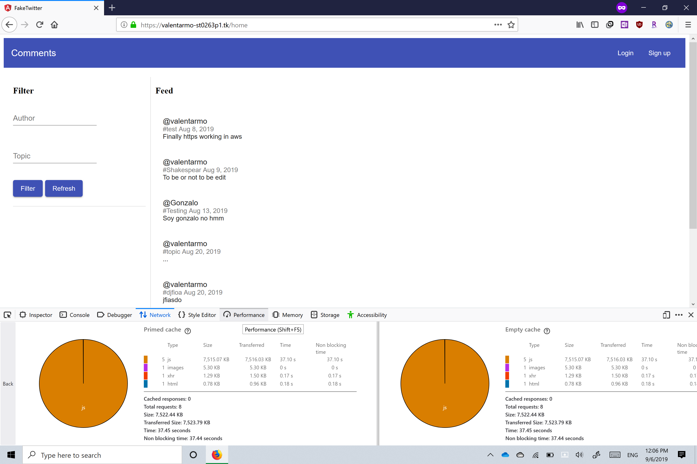
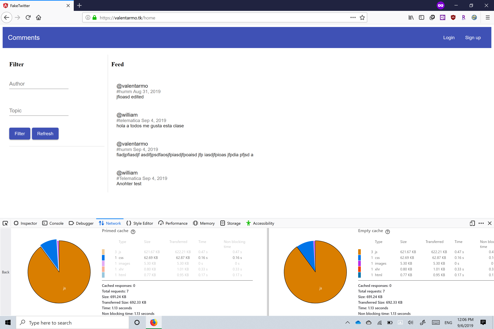
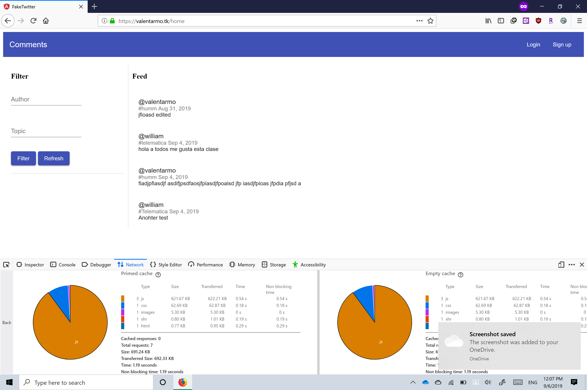

# Bitácora

## 20-07-2019 - 21-07-2019 (Semana 1)
### MOOC DevOps
Inscripción a curso de devops en coursera ([Continuous Delivery & DevOps by University of virginia](https://www.coursera.org/learn/uva-darden-continous-delivery-devops/home/welcome)).
Desarrollo de la primera semana de contenido:
* Qué es DevOps? Integración de los roles de developer, tester y ops a lo largo de la "linea de entrega" de un proyecto.
* Para? Mejorar velocidad de despliegue.
* Linea de entrega automática.
* Linea de entrega: Idea -> Software -> Pruebas unitarias -> Pruebas de integración -> Pruebas de sistema -> Despliegue

### Progreso en proyecto 1
* Creación de máquina virtual en aws e instalación de git y docker
* Aprendiendo Javascript NodeJs y Angular

## 22-07-2019 - 28-07-2019 (Semana 2)
### MOOC DevOps
* Desarrollo de la semana 2 del curso (Testing).
* Es imposible probar todo, entonces se recomienda seguir un proceso para definir que tests realizar. Es similar al proceso científico, el test es el experimento.
* Given-When-Then pattern - Método para definir tests (principalmente de sistema). Se basa en historias de usuario, existe una herramienta llamada cucumber que utiliza esta sintaxis e.g.
    * Given [Usuario no tiene cuenta]
    * (And) [...]
    * When [Ingresa su correo]
    * (And) [...]
    * Then [Se crea una cuenta un Firebase]
    * (And) [...]
* Test Stack - Entre más arriba en la piramide más costosos las pruebas
    * System/Grandes -> probar todo el sistem (Usualmente hechos por testers)
    * Integration/Medianos -> probar interacción entre funciones (Punto intermedio)
    * Unit/Pequeños -> probar funciones aisladas (Usualmente hechos por desarrolladores)

### Progreso en proyecto 1
* Reconfiguración del front end para que use servicios
* Rediseño de partes de la página
* Adición de más secciones
* Empezar a aprender a hacer el back end con mongo y nodejs

## 29-07-2019 - 04-08-2019 (Semana 3)
### MOOC DevOps
* Desarrollo de la semana 3 del curso (Ops)
* Ops son los encargados de diseñar (arquitectura), desplegar, mantener y monitorear el sistema.
* La nube a permitido automatizar este trabajo.
* Usualmente velocidad va en contra de estabilidad. DevOps intenta reducir esto.
* Infraestructura como código.
* Se busca dispobinibilad
    * Tiempo medio entre fallas
    * Tiempo medio de reparación
* Se busca baja latencia
* Se busca reducir costos
* Herramientas de Ops
    * Version control - integración continua hace que se reduzcan conflictos.

### Progreso en proyecto 1
* Finalización de la implementación de todas las funcionalidades, aunque aún hay espacio para mejorar.
* "Dockerización" de los 3 componentes angular, express, mongo.
* "Dockerización" funciona en localhost, pero parece haber un problema en el cliente al probarlo en AWS o DCA, pero los otros contenedores funcionan correctamente.

## 05-08-2019 - 11-08-2019 (Semana 4)
### MOOC DevOps
* Desarrollo de la semana 4 del curso (CI [Continuous integration] y CD [Continuous delivery])
* Herramientas (algunas)
    * Jenkins
    * Travis
    * Elysian
    * Circle CI
* Pull Requests > Direct Merge (usualmente) por que de este modo se activan más pruebas y revisiones.
* Un buen sistema CI/CD deberia ser eficiente construyendo y desplegando la aplicación, claro con los resultados de las pruebas, y no deberia requerir de mucho mantenimiento.
* Hay tensión entre velocidad y estabilidad.
* Métodos para mitigar downtime debido a errores inesperados en la CI/CD pipeline e incrementar velocidad de integración:
    * Rollback
    * Blue/Green pattern - Tener un "bloque" de desarrollo y un "bloque" para usuarios, que se intercambian cada que hay cambios estables.
    * Feature Flags - Anillos de usuarios, se empieza a probar con los usuarios "internos" y continua capa por capa hacia los externos, permite un tipo de switch de funcionalidades.
* Microservicios - Aplicaciones pequeñas que son independientes pero interactuan entre ellas, este patrón es más escalable, pero mas dificil de poner a prueba.

### Progreso en proyecto 1
* Despliegue de la aplicación en AWS y DCA con soporte para https.

## 26-08-2019 - 01-09-2019
### Progreso en proyecto 2 Performance
* Checklist de performance teniendo en cuenta el libro:
- [x] Jmeter tests antes de mejoras.
- [x] Jmeter tests después de mejoras.
- [x] Responsive design.
- [x] Optimizar performance de nginx.
- [x] Reducir tamaño de recursos estáticos.
- [x] Distribución geográfica (no aplica).
- [ ] Repetir tests después de realizadas las tareas de disponibilidad y seguridad.

## 02-09-2019 - 08-09-2029
#### Tests antes de mejoras
---

[jmeter](performance/jmeter/before_1024)

#### Tests después de mejoras
---
El tiempo de carga pasó de ~40s a ~2s y las TPS pasaron de 3.7 a 12.37

[jmeter](performance/jmeter/after_1024)

#### Tests después de realizadas las tareas de disponibilidad y seguridad
---
TODO

## 11-09-2019
Adición de cookies a la página, y corrección de bug que hacía que fallara la actualización de la página en http.

## 15-09-2019
#### Atributos de Seguridad - William Cadenas
En las estrategias que se pueden tomar para lograr cumplir con los atributos deseados se encuentra las siguientes tres capas: Confidencialidad, Integridad y Disponibilidad.

La confidencialidad trata de mantener todos los datos seguros y no pueden ser expuestos a usuarios que no tengan el permiso requerido para ver dichos datos. En nuestra app no existen datos delicados pero mas sin embargo las contraseñas el cual es el único dato delicado se encuentra protegido en la base de datos con una encriptación la cual le provee el atributo de confidencialidad.

Integridad se trata de lograr que todos los datos no se afectados por las transacciones realizadas por el sistema y además no proporcionar datos corruptos. En nuestra app se encuentran como dato sensible los Tweets los cuales no poseen ningún momento en que se les pueda modificar por dos transacciones la tiempo, y lo único que podría verse comprometido es mientras viajan pero los servidores están en https así que cualquier ataque de Man-in-the-Middle está cubierto.

Por último está la capa de disponibilidad la cual se mezcla con la de mi compañero Juan el cual se está encargando de que el servidor pueda soportar fallos y funcionar con un balanceador de carga para resolver cualquier imprevisto aplicando Failover y otras técnicas de crecimiento horizontal.

### Esquema seguido para detectar que atributo de seguridad implementaríamos

Guiándonos del texto guía seguimos la metodología propuesta la cual consiste en una serie de pasos para proponer políticas de seguridad acordes al proyecto o negocio y así poder atacar los puntos más débiles primero y darles un valor en una tabla en la cual se mide el impacto y la probabilidad dando como resultado bajo, medio y alto. Y ya con esto seremos capaces de escoger políticas para que se encarguen de los diferentes causantes("threats") de dichas vulnerabilidades.

### Políticas implementadas
* Data Transmission layer: se implementó https el cual ya venía desde proyecto 1 pero de igual forma se volvió a procurar que la página tuviese este puerto seguro para proteger la transmisión de la información sensible y los posibles ataques de Man-in.the-middle.

* Password Strength Policy: se implementó una serie de políticas para la construcción de las contraseñas de la plataforma ya que notamos que uno de los puntos vulnerables con las contraseñas que el usuario puede escoger, siendo estas muy fáciles de descifrar y exponiendo la seguridad de los mismos.
    * Deben tener al menos 8 caracteres.
    * Deben ser alfanumericos (osea contener letras y números).
    * Deben tener por lo menos una letra en Mayúscula y una en Minúscula.
    * Y por último contener al menos un carácter especial.

* Otros: se analizan problemas como los de SQL-inyection los cuales son muy comunes también pero gracias a la naturaleza de nuestra base de datos, la cual es Mongodb no tenemos ese tipo de vulnerabilidades por la forma en cómo se realizan los queries. 

